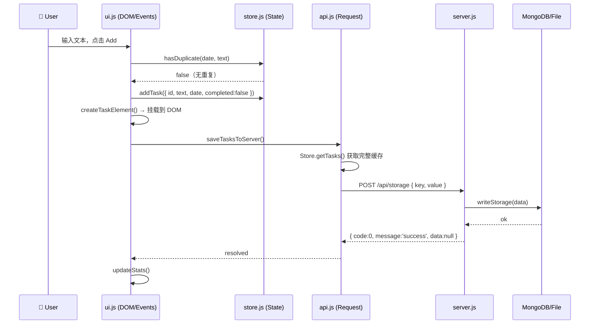

# Architecture — Willah's Done List

> 本文档描述重构后的系统架构、各层职责边界，以及后续开发必须遵守的分层规范。

---

## 全局架构与数据流转图

```mermaid
graph TD
    User((👤 User)) -->|click / input| UI

    subgraph Frontend["前端（4 个独立文件，按序加载）"]
        direction TB
        HTML["index.html\n纯 DOM 骨架 + CSS\n无任何内联 JS"]
        UI["ui.js\nDOM 渲染 + 事件代理\nstartEdit / applyTasks"]
        API_JS["api.js\nrequest() 拦截器\nloadTasksFromServer\nsaveTasksToServer\npollAndMergeTasks"]
        STORE["store.js\n状态管理\n_tasks / _editingTaskId\nhasDuplicate / normalizeTask"]
    end

    UI -->|Store.addTask / updateTask / removeTask| STORE
    UI -->|Api.saveTasksToServer / loadTasksFromServer| API_JS
    STORE -->|Store.isEditing()| API_JS
    API_JS -->|HTTP + BizCode 解析| Server

    subgraph Server["server.js（Express）"]
        Router[路由分发]
        BizCode["BizCode 枚举\nok() / fail() 辅助函数"]
        ReadWrite[readStorage / writeStorage]
    end

    Router --> BizCode --> ReadWrite
    ReadWrite -->|优先| MongoDB[(MongoDB\n生产环境)]
    ReadWrite -->|降级| FileDB[(storage.json\n本地文件)]

    Server -->|{ code, message, data }| API_JS
    UI -->|render DOM| User
```

---

## 核心数据流（以「添加任务」为例）



---

## 前端文件职责边界

| 文件 | 职责 | 代表函数 / 变量 | 允许访问 |
|---|---|---|---|
| `index.html` | 纯静态骨架，提供 DOM 结构和 CSS 样式 | `<div>` 骨架 + `<script src>` × 3 | 无 JS |
| `store.js` | 内存状态 + 纯数据操作，暴露 `Store` 全局对象 | `getTasks / setTasks / addTask / updateTask / removeTask / hasDuplicate / isEditing / setEditing / clearEditing` | 不得访问 DOM，不得调用 fetch |
| `api.js` | 所有 HTTP I/O，暴露 `Api` 全局对象；UI 更新通过回调解耦 | `request / loadTasksFromServer / saveTasksToServer / pollAndMergeTasks / Api.init(callbacks)` | 可访问 `Store`，不得直接操作 DOM |
| `ui.js` | DOM 渲染 + 全部事件绑定，初始化整个应用 | `applyTasks / updateStats / startEdit / addTask / runQuery` + 所有 `addEventListener` | 可访问 `Store` 和 `Api` |

**单向依赖（无循环）**：

```
index.html
  └── ui.js    → 依赖 store.js + api.js
        store.js → 无外部依赖（纯数据）
        api.js   → 依赖 store.js（读取 isEditing 状态）
```

---

## 编辑状态保护机制

手机端软键盘弹起导致 Edit 状态丢失的根本解法：

- `store.js` 维护 `_editingTaskId`（JS 状态变量）
- `ui.js` 的 `startEdit()` 调用 `Store.setEditing(id)`；Save / Cancel 调用 `Store.clearEditing()`
- `api.js` 的 `pollAndMergeTasks()` 通过 `Store.isEditing()` 决定是否重建 DOM
- 任何视口变化（软键盘、resize、scroll）均不影响 JS 层状态标志

---

## ⚠️ 开发规范：禁止在 index.html 中写内联 JS

> **这是本项目的强制性架构约束，适用于所有后续功能开发。**

### 禁止行为

```html
<!-- ❌ 严禁：在 index.html 中直接写业务逻辑 -->
<script>
  fetch('/api/storage').then(...)
  document.getElementById('btn').onclick = function() { ... }
</script>
```

### 正确做法

| 需求类型 | 应放入的文件 |
|---|---|
| 新增数据字段或校验逻辑 | `store.js` |
| 新增 API 接口调用 | `api.js` |
| 新增 UI 组件或事件绑定 | `ui.js` |
| 新增 HTML 结构或样式 | `index.html`（仅限 HTML/CSS） |

### 原因

`index.html` 的内联 JS 是导致原始版本代码腐化（1069 行混沌）的根本原因：状态、网络、DOM 三者高度耦合，任何改动都可能产生连锁 Bug。重构后的四层分离架构通过文件边界强制执行关注点分离，必须严格遵守。

---

## 后端 API 响应规范

所有接口返回统一结构（`/health` 除外）：

```json
{ "code": 0, "message": "success", "data": null }
```

BizCode 枚举见 [`DATA_DICTIONARY.md`](./DATA_DICTIONARY.md)。
