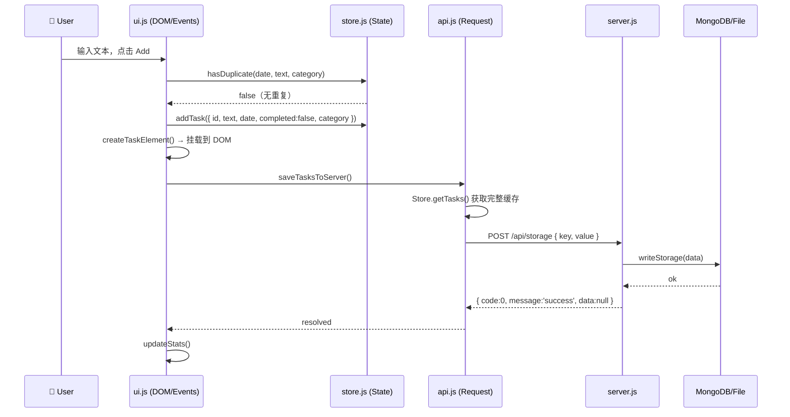

# Architecture — Done List

> 本文档描述重构后的系统架构、各层职责边界，以及后续开发必须遵守的分层规范。

---

## 全局架构与数据流转图

```mermaid
graph TD
    User((👤 User)) -->|click / input| UI

    subgraph Frontend["前端（5 个独立文件，按序加载）"]
        direction TB
        CONFIG["config.js\n全局配置（纯数据）\n分类定义 / 主题色 / 文案 / API 地址"]
        HTML["index.html\n纯 DOM 骨架 + CSS 变量\n无任何内联 JS"]
        UI["ui.js\nDOM 渲染 + 事件代理\napplyConfig / applyTasks"]
        API_JS["api.js\nrequest() 拦截器\nloadTasksFromServer\nsaveTasksToServer\npollAndMergeTasks"]
        STORE["store.js\n状态管理\n_tasks / _editingTaskId / _currentCategory\nhasDuplicate / normalizeTask"]
    end

    CONFIG -->|CONFIG 全局对象| UI
    CONFIG -->|CONFIG 全局对象| STORE
    CONFIG -->|CONFIG 全局对象| API_JS

    UI -->|Store.addTask / updateTask / removeTask| STORE
    UI -->|Api.saveTasksToServer / loadTasksFromServer| API_JS
    STORE -->|Store.isEditing()| API_JS
    API_JS -->|HTTP + BizCode 解析| Server

    subgraph Server["server.js（Express）"]
        Router[路由分发]
        BizCode["BizCode 枚举\nok() / fail() 辅助函数"]
        ReadWrite[readStorage / writeStorage]
        Dedup["hasDuplicateTasks\nPOST todoList 写入前 (date+text+category) 校验"]
    end
    Router --> BizCode --> ReadWrite
    ReadWrite -->|优先| MongoDB[(MongoDB\n生产环境)]
    ReadWrite -->|降级| FileDB[(storage.json\n本地文件)]

    Server -->|{ code, message, data }| API_JS
    UI -->|render DOM| User
```

---

## 核心数据流（以「添加任务」为例）



---

## 前端文件职责边界

| 文件 | 职责 | 代表函数 / 变量 | 允许访问 |
|---|---|---|---|
| `config.js` | 全局配置定义，暴露 `CONFIG` 全局对象 | `categories / theme / text / API_BASE_URL / getCategoryLabel / getCategoryColor` | 纯数据，不得访问 DOM 或网络 |
| `index.html` | 纯静态骨架，CSS 变量驱动主题色 | `<div>` 骨架 + CSS 变量 + `<script src>` × 4 | 无 JS |
| `store.js` | 内存状态 + 纯数据操作，暴露 `Store` 全局对象 | `getTasks / setTasks / addTask / updateTask / removeTask / hasDuplicate / isEditing / setEditing / clearEditing / getCategory / setCategory / getTasksByCategory / getCompletedTasksGrouped` | 不得访问 DOM，不得调用 fetch |
| `api.js` | 所有 HTTP I/O，暴露 `Api` 全局对象；UI 更新通过回调解耦 | `request / loadTasksFromServer / saveTasksToServer / pollAndMergeTasks / Api.init(callbacks)` | 可访问 `Store`，不得直接操作 DOM |
| `ui.js` | DOM 渲染 + 全部事件绑定，初始化整个应用 | `applyTasks / renderDoneList / updateStats / startEdit / addTask / runQuery / renderHeatmap / openDayDrawer` + 热力图与 Bottom Drawer | 可访问 `Store` 和 `Api` |

**单向依赖（无循环）**：

```
index.html
  └── config.js → 无外部依赖（纯数据定义）
  └── store.js  → 依赖 config.js（读取分类列表、默认分类）
  └── api.js    → 依赖 store.js + config.js（API 地址、同步间隔）
  └── ui.js     → 依赖 store.js + api.js + config.js（主题色、文案、分类定义）
```

---

## 编辑状态保护机制

手机端软键盘弹起导致 Edit 状态丢失的根本解法：

- `store.js` 维护 `_editingTaskId`（JS 状态变量）
- `ui.js` 的 `startEdit()` 调用 `Store.setEditing(id)`；Save / Cancel 调用 `Store.clearEditing()`
- `api.js` 的 `pollAndMergeTasks()` 通过 `Store.isEditing()` 决定是否重建 DOM
- 任何视口变化（软键盘、resize、scroll）均不影响 JS 层状态标志

---

## 任务分类窗口（Task Categories）

任务分为三个独立窗口（分类），用户可通过 Tab Bar 切换：

| 窗口 | `category` 值 | 描述 |
|---|---|---|
| Bachelor | `"bachelor"` | 学业、课程、学习 |
| Self | `"self"` | 个人成长、生活、健康（默认） |
| Career | `"career"` | 工作、实习、职业发展 |

- **数据层**：`Store._currentCategory` 维护当前激活分类；`normalizeTask()` 自动为缺失 `category` 的历史数据补全 `"self"`；`getCompletedTasksGrouped(date)` 返回按分类分组的已完成任务
- **UI 层**：分类 Tab Bar 位于输入框上方；切换时重新渲染当前分类的任务列表和统计面板
- **编辑功能**：编辑弹窗/内联编辑均包含分类选择器，修改分类后任务从当前 Tab 消失并归入目标分类；无实际变更时不触发 API 请求
- **已完成任务栏**：按 Bachelor/Self/Career 分组展示当日已完成任务，每组带彩色侧边条标识；无任务的分组标题置灰
- **查询/Drawer**：展示所有分类的汇总数据，任务块上显示分类角标（`.task-category-badge`）
- **去重**：`(date, text, category)` 三元组唯一，不同分类下可有同名任务
- **API 层**：无新端点，按分类过滤为纯前端行为

---

## 配置管理（config.js）

`config.js` 是全局配置中心，通过 `CONFIG` 对象集中管理所有可定制参数，实现"配置与代码分离"。

### 可配置项

| 配置域 | 说明 | 示例 |
|---|---|---|
| `categories` | 分类定义数组（key / label / color） | 增删改分类只需修改此数组 |
| `DEFAULT_CATEGORY` | 默认激活分类 | `'self'` |
| `theme` | 主题色（primary / secondary / danger 等） | 修改 `primary` 即全站换色 |
| `heatmapLevels` | 热力图 5 级色阶 | 紫色系 HSL 数组 |
| `API_BASE_URL` | 后端 API 基准地址 | 切换环境只需改此值 |
| `SYNC_INTERVAL_MS` | 多端同步轮询间隔 | `3000`（毫秒） |
| `text` | 全部 UI 文案（标题、按钮、提示语等） | 支持多语言切换 |

### 运作机制

1. `config.js` 在 `<script>` 加载序列中排第一位
2. `ui.js` 初始化时调用 `applyConfig()`：
   - 将 `theme` 写入 CSS 变量（`--c-primary` 等），驱动全站样式
   - 将 `text` 注入 DOM 元素（标题、按钮、占位符等）
   - 根据 `categories` 动态生成 Tab Bar 和编辑弹窗 `<select>` 选项
3. `store.js` 和 `api.js` 读取 `CONFIG` 获取分类列表和网络参数
4. 容错：所有 `CONFIG` 读取均有 `typeof CONFIG !== 'undefined'` 保护

### 快速定制示例

- **换色**：修改 `config.js` 中 `theme.primary` → 全站主色变更
- **加分类**：在 `categories` 数组末尾追加 `{ key: 'health', label: 'Health', color: '...' }` → Tab Bar 自动多出一个标签
- **换环境**：修改 `API_BASE_URL` → 所有请求指向新地址

---

## ⚠️ 开发规范：禁止在 index.html 中写内联 JS

> **这是本项目的强制性架构约束，适用于所有后续功能开发。**

### 禁止行为

```html
<!-- ❌ 严禁：在 index.html 中直接写业务逻辑 -->
<script>
  fetch('/api/storage').then(...)
  document.getElementById('btn').onclick = function() { ... }
</script>
```

### 正确做法

| 需求类型 | 应放入的文件 |
|---|---|
| 新增可配置参数（颜色、文案、分类等） | `config.js` |
| 新增数据字段或校验逻辑 | `store.js` |
| 新增 API 接口调用 | `api.js` |
| 新增 UI 组件或事件绑定 | `ui.js` |
| 新增 HTML 结构或样式 | `index.html`（仅限 HTML/CSS） |

### 原因

`index.html` 的内联 JS 是导致原始版本代码腐化（1069 行混沌）的根本原因：状态、网络、DOM 三者高度耦合，任何改动都可能产生连锁 Bug。重构后的四层分离架构通过文件边界强制执行关注点分离，必须严格遵守。

---

## 后端 API 响应规范

所有接口返回统一结构（`/health` 除外）：

```json
{ "code": 0, "message": "success", "data": null }
```

BizCode 枚举见 [`DATA_DICTIONARY.md`](./DATA_DICTIONARY.md)。  
**POST `/api/storage`** 当 `key === 'todoList'` 时，服务端在写入前调用 `hasDuplicateTasks(value)` 校验 (date + text + category) 唯一性，若重复则返回 `code: 2001`（见 DATA_DICTIONARY）。

**任务查询模块**：含热力图点阵，展示时长与查询起止日期一致（未选时默认最近 90 天），紫色系深浅表示当日任务数量；桌面端点阵与列表左右并排、点击某日切换列表，移动端仅点阵、点击某日底部 Drawer 展示该日任务。任务块样式：未完成任务浅紫底无边框，已完成任务浅灰底无边框、无删除线；本日任务、查询结果、Drawer 内任务均统一该两种样式。

---

## 运行时配置覆盖机制（Visual Config Manager）

浏览器无法直接修改服务器上的 `config.js`，因此采用**双层配置覆盖**策略，使非技术人员也能通过 UI 界面修改配置。

### 双层覆盖流程

```
页面加载
  │
  ├─ 1. config.js 定义 _defaults（代码内置默认值）
  │
  ├─ 2. 检查 localStorage('done_list_config')
  │     ├─ 存在 → deepMerge(_defaults, userOverrides) = _effective
  │     └─ 不存在 → _effective = _defaults 副本
  │
  └─ 3. CONFIG 公开接口读取 _effective（运行时生效配置）
```

- **深合并**：对象类型递归合并（用户只覆盖修改过的字段），数组类型整体替换（如 `categories`）
- **保存**：设置面板修改后，将完整配置对象序列化为 JSON 存入 `localStorage`，然后 `window.location.reload()` 使新配置生效
- **重置**：清空 `localStorage` 中的 `done_list_config` 键，恢复 `config.js` 的原始定义

### 设置面板（Settings Drawer）

| 组件 | 位置 | 说明 |
|---|---|---|
| 齿轮图标 `⚙` | 页面右上角 header 内 | 点击打开右侧抽屉 |
| 基础设置 | API Base URL 输入框 | 带格式校验（HTTP/HTTPS） |
| 主题色 | Primary / Secondary 颜色选择器 | 修改时实时预览（CSS 变量热切换） |
| 文案自定义 | 页面标题 / 副标题 | 保存后生效 |
| 分类管理 | 列表形式展示 | 支持修改 label、color，添加新分类，删除分类（有任务时警告） |
| 保存并应用 | 底部按钮 | `CONFIG.saveUserOverrides()` → `reload()` |
| 重置为默认 | 底部按钮 | `CONFIG.clearUserOverrides()` → `reload()` |

### 实时预览

颜色选择器的 `oninput` 事件直接调用 `document.documentElement.style.setProperty('--c-primary', v)`，利用 CSS 变量实现无刷新实时换肤。保存时全量写入 `localStorage`，页面 reload 后由 `config.js` 的合并逻辑确保配置持久化。

### 文件职责

- `config.js`：`_defaults` 定义、`deepMerge` 合并、`loadUserOverrides / saveUserOverrides / clearUserOverrides` 读写 localStorage、`getDefaults() / getEffective()` 公开接口
- `ui.js`：`openSettings / closeSettings / renderSettingsBody / saveSettings / resetSettings` 设置面板 UI 与交互逻辑
- `index.html`：设置面板 DOM 骨架（`#settings-drawer / #settings-overlay`）+ CSS 样式
